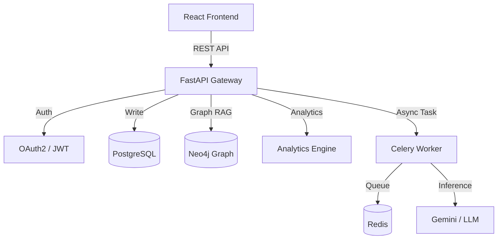

# 🌍 EcoTwin: AI-Powered Carbon Intelligence Platform

[](https://opensource.org/licenses/MIT)
[](https://www.python.org/)
[](https://reactjs.org/)
[](https://fastapi.tiangolo.com/)

**EcoTwin** is a production-grade digital twin platform designed to track, analyze, and forecast personal carbon footprints. Unlike simple calculators, EcoTwin uses **Graph RAG (Retrieval Augmented Generation)** and **Predictive Analytics** to model complex relationships between user activities and their environmental impact.

---

## ✨ Key Features (The Truth)

### 🧠 Intelligent Core
- **Advanced Analytics Engine**: Uses **Linear Regression** (`scikit-learn`) to forecast future carbon emissions based on historical trends.
- **Anomaly Detection**: Automatically flags statistical outliers (e.g., unusual spikes in movement or consumption) using Z-Score analysis.
- **Graph Knowledge Base**: Built on **Neo4j** to map relationships (e.g., `User -[PERFORMED]-> Activity -[IMPACTS]-> Environment`).

### 🛡️ Enterprise Security
- **Defense in Depth**: Full implementation of **OAuth2** (JWT), **Rate Limiting** (via `slowapi`), and Security Headers (HSTS, XSS Protection).
- **Hardened Architecture**: Parameterized queries to prevent Injection attacks; strict allow-listing for dynamic Graph queries.

### ⚡ High Performance
- **Optimized Database**: Customized SQLAlchemy connection pooling (Size: 40, Recycle: 1800s) for high-concurrency workloads.
- **Async & Resilient**: AI inference is wrapped in **Exponential Backoff Retries** (`tenacity`) to handle network instability gracefully.
- **Production Logging**: Structured JSON logging pipeline ready for Splunk/Datadog ingestion.

---

## 🏗️ Architecture

The system follows a modualr **Service-Oriented Architecture**:



---

## 🚀 Getting Started

### Prerequisites
- Docker & Docker Compose
- Python 3.11+ (for local dev)
- Node.js 18+ (for local dev)

### One-Click Deployment
We provide a unified deployment script for production-like verification.

```bash
# Windows (PowerShell)
./deploy.sh
```

This will:
1.  Spin up **PostgreSQL**, **Neo4j**, **Redis** in Docker.
2.  Build the **Backend** (Multi-stage Dockerfile).
3.  Start the **Frontend** development server.
4.  Run database migrations automatically.

---

## 🧪 Verification (Working Proof)

Once deployed, verify the health of the system:

1.  **System Pulse**:
    - GET `http://localhost:8000/api/v1/health`
    - *Expected*: `{"status": "healthy", "components": {"postgres": "up", "neo4j": "up", "redis": "up"}}`

2.  **Forecast Demo**:
    - GET `http://localhost:8000/api/v1/analytics/forecast?days=7`
    - *Expected*: JSON list of predicted carbon values for the next week.

3.  **API Documentation**:
    - Visit `http://localhost:8000/docs` for the interactive Swagger UI.

---

## 📂 Project Structure

```text
EcoTwin/
├── backend/
│   ├── app/
│   │   ├── api/          # Endpoints (Activities, Analytics, Health)
│   │   ├── core/         # Config, Security, Logging
│   │   ├── db/           # Neoj4 Driver, Postgres Session
│   │   ├── services/     # Business Logic (ActivityService, Analytics)
│   │   └── main.py       # App Entrypoint
│   ├── tests/            # Pytest Sanity Checks
│   └── Dockerfile        # Multi-stage build
├── frontend/
│   ├── src/
│   │   ├── components/   # UI Components (Charts, Cards)
│   │   ├── pages/        # Dashboard
│   │   └── services/     # Axios API Client
│   └── package.json
└── deploy.sh             # Master Deployment Script
```

---

## 🤝 Contributing

This project is a "Gold Master" reference implementation.
1.  Fork the repository.
2.  Create a feature branch.
3.  Submit a Pull Request.

---

*Built with precision by SidTheBuilder.*
